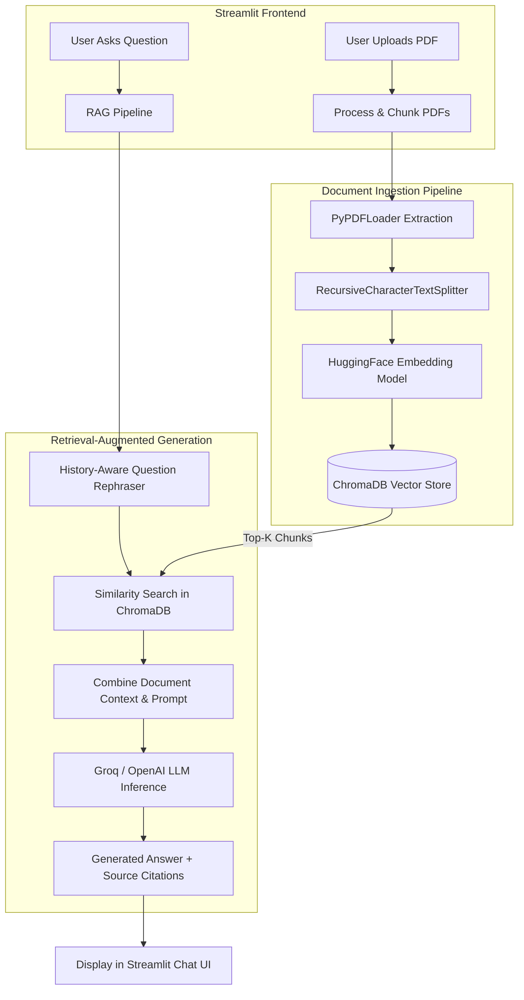

# 📚 Production-Ready AI PDF Chatbot (RAG Architecture)

A production-grade, modular **Retrieval-Augmented Generation (RAG)** application built with **Streamlit**, **LangChain**, **ChromaDB**, and **Groq AI**. This system allows users to upload PDF documents, automatically index and embed text into a persistent vector database, ask questions in natural language with conversational memory, and view exact page citations for every response.

---

## 🌟 Key Features

- 📄 **Multi-PDF Processing**: Upload single or multiple PDF documents simultaneously.
- ✂️ **Smart Text Chunking**: Leverages LangChain's `RecursiveCharacterTextSplitter` with configurable chunk sizes and overlaps.
- ⚡ **Local Vector Embeddings**: Uses `sentence-transformers/all-MiniLM-L6-v2` locally via `langchain-huggingface` to eliminate external embedding API fees and rate limits.
- 🗄️ **Persistent Vector Database**: Stores vector embeddings locally using **ChromaDB**, preserving indexed data across app sessions.
- 🚀 **High-Speed Inference**: Powered by **Groq API** (`llama-3.3-70b-versatile`) or OpenAI-compatible models.
- 💬 **Conversational Memory**: Rephrases questions based on chat history to maintain seamless multi-turn conversations.
- 📌 **Exact Source Citations**: Displays exact source PDF filenames, 1-indexed page numbers, and text snippets used to formulate each answer.
- 🛡️ **Production Design**: Clean modular code structure, environment validation, logging, and error handling.

---

## 🏗️ System Architecture



---

## 📁 Folder Structure

```
ai-rag-chatbot/
├── .env.example              # Environment variable template
├── .gitignore                # Git exclusion rules
├── requirements.txt          # Production dependency specifications
├── README.md                 # Complete project documentation
├── app.py                    # Main Streamlit web application & UI
├── config/
│   ├── __init__.py
│   └── settings.py           # Configuration loader with dotenv and validation
├── src/
│   ├── __init__.py
│   ├── document_processor.py # PDF loader, text extraction & chunking
│   ├── vector_store.py       # ChromaDB vector store & embedding manager
│   ├── rag_chain.py          # LangChain RAG pipeline & history context
│   └── utils/
│       ├── __init__.py
│       └── logger.py         # Formatted logging system
└── data/
    ├── .gitkeep              # Data directory placeholder
    └── chroma_db/            # Local ChromaDB persistent database store
```

### Folder & File Descriptions

| File / Folder | Purpose |
| :--- | :--- |
| `app.py` | Streamlit entry point managing state, chat interface, sidebar, document uploader, and user interactions. |
| `config/settings.py` | Centralized settings management loading `.env` parameters with fallbacks and API key validation. |
| `src/document_processor.py` | Handles PDF parsing with `PyPDFLoader`, metadata enrichment (source name, page numbers), and text splitting. |
| `src/vector_store.py` | Manages local HuggingFace embeddings (`all-MiniLM-L6-v2`) and persistent ChromaDB collection lifecycle. |
| `src/rag_chain.py` | Assembles LangChain `history_aware_retriever`, `create_stuff_documents_chain`, and citation formatter. |
| `src/utils/logger.py` | Provides clean stdout logging for debugging and tracking request cycles. |
| `data/chroma_db/` | Persistent directory housing ChromaDB vector indices, metadata, and SQLite database. |

---

## ⚡ Setup & Installation

### Prerequisites
- **Python 3.10+** installed.
- A free **Groq API Key** from [Groq Console](https://console.groq.com/keys) (or OpenAI API Key).

### Step-by-Step Installation

1. **Clone the Repository**
   ```bash
   git clone https://github.com/your-username/ai-rag-chatbot.git
   cd ai-rag-chatbot
   ```

2. **Create and Activate a Virtual Environment**
   - **Linux / macOS**:
     ```bash
     python3 -m venv .venv
     source .venv/bin/activate
     ```
   - **Windows (PowerShell)**:
     ```powershell
     python -m venv .venv
     .\.venv\Scripts\Activate.ps1
     ```

3. **Install Dependencies**
   ```bash
   pip install -r requirements.txt
   ```

4. **Configure Environment Variables**
   Copy `.env.example` to `.env`:
   ```bash
   cp .env.example .env
   ```
   Open `.env` and add your **Groq API Key**:
   ```env
   GROQ_API_KEY=gsk_your_actual_groq_api_key_here
   LLM_PROVIDER=groq
   MODEL_NAME=llama-3.3-70b-versatile
   ```

5. **Run the Streamlit Application**
   ```bash
   streamlit run app.py
   ```
   Open your browser at `http://localhost:8501`.

---

## 🔁 Complete Request Flow

```
[Upload PDF] ➡️ [Page Extraction] ➡️ [Text Chunking] ➡️ [Vector Embedding] ➡️ [ChromaDB Indexing]
                                                                                        │
[User Query] ➡️ [History Rephrase] ➡️ [Similarity Search] ➡️ [Context Injection] ➡️ [LLM Inference] ➡️ [Answer + Citations]
```

1. **PDF Upload & Ingestion**:
   - The user selects one or more PDF files in the Streamlit sidebar and clicks **Process & Embed PDFs**.
   - `DocumentProcessor` saves files to a temporary directory and loads them using `PyPDFLoader`.
   - Each page is extracted into a `Document` object with metadata storing `source_name` (filename) and `page` (1-indexed page number).

2. **Chunking**:
   - `RecursiveCharacterTextSplitter` divides page content into chunks (default: 1000 characters with 200 overlap).
   - Overlap ensures context is preserved across chunk boundaries.

3. **Embedding Generation & Vector Storage**:
   - `VectorStoreManager` passes document chunks to `HuggingFaceEmbeddings` (`sentence-transformers/all-MiniLM-L6-v2`).
   - The 384-dimensional dense vectors are saved into local persistent **ChromaDB** storage (`./data/chroma_db`).

4. **User Query & Contextual Rephrasing**:
   - The user types a question in the chat input.
   - If prior conversation history exists, `create_history_aware_retriever` passes history and query to Groq LLM to convert vague queries (e.g., *"What did it say about that?"*) into standalone search queries.

5. **Vector Retrieval**:
   - ChromaDB calculates cosine/similarity distance between the search query vector and stored document vectors.
   - The Top-$K$ (default: 4) most relevant chunks are retrieved with their metadata.

6. **LLM Generation & Source Citations**:
   - `create_stuff_documents_chain` combines retrieved chunks into an augmented prompt context.
   - Groq's LLM (`llama-3.3-70b-versatile`) generates a grounded answer based strictly on the retrieved context.
   - `RAGPipeline` extracts file sources, page numbers, and text snippets from retrieved document metadata, rendering expandable citations under the chat response.

---

## 🧩 How LangChain & ChromaDB Work in This Project

### LangChain Orchestration
LangChain acts as the primary workflow engine, chaining together data structures, models, and retrievers:
- **`PyPDFLoader`**: Parses PDF layout into structured documents.
- **`RecursiveCharacterTextSplitter`**: Splitting strategy prioritizing paragraph breaks `\n\n`, line breaks `\n`, and spaces to preserve semantic unity.
- **`create_history_aware_retriever`**: Dynamically handles conversational continuity by rephrasing user queries using chat history before querying the vector store.
- **`create_stuff_documents_chain` & `create_retrieval_chain`**: Formats system prompts, injects retrieved documents into the LLM context window, and executes the call to `ChatGroq`.

### ChromaDB Vector Database
ChromaDB functions as the high-performance local vector database:
- **Persistence**: Unlike in-memory vector stores, ChromaDB persists embeddings to disk (`./data/chroma_db`), avoiding re-indexing files across application restarts.
- **Metadata Association**: Stores raw text content along with structured metadata (`source_name`, `page`), allowing instant lookup and verification of citations.
- **Similarity Search**: Performs fast nearest-neighbor search over high-dimensional vector embeddings to supply top matching context to the LLM.

---

## 📸 Screenshots

*(Add screenshots of your application interface here)*

| Sidebar & Document Processing | Interactive Chat with Source Citations |
| :---: | :---: |
|  |  |

---

## 🛠️ Tech Stack

- **Frontend**: [Streamlit](https://streamlit.io/)
- **Orchestration**: [LangChain](https://python.langchain.com/)
- **Vector Database**: [ChromaDB](https://www.trychroma.com/)
- **Embeddings**: [HuggingFace Sentence Transformers](https://huggingface.co/sentence-transformers/all-MiniLM-L6-v2)
- **LLM Engine**: [Groq Cloud API](https://groq.com/) / [OpenAI](https://openai.com/)
- **PDF Parser**: [PyPDF](https://pypdf.readthedocs.io/)
